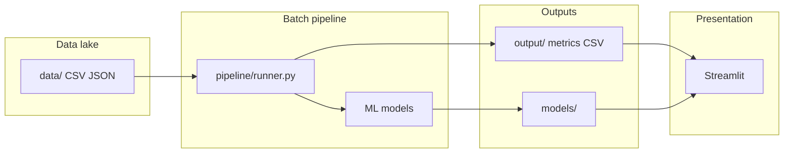

# E-Commerce Big Data Analytics — Presentation Document

*Use this outline for slides (PowerPoint, Google Slides, Canva) or speaker notes. Each `---` suggests a new slide.*

**Repository:** [github.com/Kinoti-mitchell/ecommerce](https://github.com/Kinoti-mitchell/ecommerce)  
**Stack:** Python · pandas · scikit-learn · TextBlob · mlxtend · optional PySpark · Streamlit

---

## Slide 1 — Title

**Big Data Analytics for E-Commerce**  
*Fraud detection, sentiment, market basket, churn, and recommendations*

**Author:** [Your name]  
**Course / context:** [e.g. Big Data module, capstone]  
**Date:** [Date]

---

## Slide 2 — Objective

**What we built**

- An end-to-end **analytics pipeline** that mimics how retailers use **large-scale data** for decisions.
- **Five analytics modules** plus a **Streamlit dashboard** for exploration.
- **Hadoop concepts** (HDFS-style storage, MapReduce pattern) **simulated in Python**, with **optional Apache Spark** for batch SQL-style aggregation.

**Why it matters**

- E-commerce generates **high volume** transactions, reviews, and click streams.
- Batch + near-real-time analytics support **fraud prevention**, **personalization**, and **retention**.

---

## Slide 3 — High-level architecture



**Flow:** Synthetic **data lake** → **cleaning & features** → **train & score** → **metrics & artifacts** → **dashboard**.

---

## Slide 4 — Simulated Hadoop / Big Data layer

| Real-world idea | What we implemented |
|-----------------|---------------------|
| **HDFS** | Folder `data/` as a **data lake** (transactions, reviews, baskets, churn features, ratings) |
| **MapReduce** | `utils/mapreduce_helpers.py`: **map** per chunk → **shuffle** by key → **reduce** (e.g. per-user fraud rollups) |
| **Spark** | `spark_jobs/batch_processing.py`: optional **PySpark** `groupBy` (`USE_PYSPARK=1`); default **pandas chunked** “reduce” |

**Note:** No production Hadoop cluster required—suitable for **learning and demos** while keeping the **same mental model** as distributed batch jobs.

---

## Slide 5 — Data & data quality

**Synthetic datasets (configurable sizes)**

- **Full mode:** ~55k transactions, 12k reviews, 25k order lines, 15k churn profiles, 40k ratings (typical).
- **Quick mode:** `STREAMLIT_QUICK=1` — smaller tables for **faster runs** (e.g. hosted Streamlit).

**Intentional “messy” data**

- Missing values, invalid amounts, noisy review text.
- **Cleaning** in `utils/cleaning.py` → compare **baseline vs full pipeline** (e.g. fraud model on amount-only vs engineered features).

---

## Slide 6 — Module 1: Credit card fraud detection

**Goal:** Score transactions with a **fraud probability**.

**Features (examples)**

- Unusual location vs user’s typical location  
- High spend vs user-level amount distribution  
- New device for that user  

**Model:** Random Forest (imbalanced class handling).

**Outputs:** `fraud_scored_transactions.csv`, metrics in `output/metrics.json`.

---

## Slide 7 — Module 2: Sentiment analysis

**Goal:** Classify **product reviews** as positive / negative / neutral.

**Method:** **TextBlob** polarity → rule-based labels.

**Outputs:** Scored reviews CSV; accuracy vs **synthetic** gold labels for teaching.

**Real-world:** At scale you’d use larger corpora, multilingual models, or hosted NLP APIs.

---

## Slide 8 — Module 3: Market basket analysis

**Goal:** Find **association rules** (“customers who bought A also bought B”).

**Method:** **Apriori** (via **mlxtend**), with a **fallback** miner if mlxtend is unavailable.

**Outputs:** `association_rules.csv`, frequent itemsets.

**Real-world:** Spark **FP-Growth** for very large transaction logs on a cluster.

---

## Slide 9 — Module 4: Customer churn prediction

**Goal:** Predict **churn probability** from behavior (tenure, spend, sessions, support tickets).

**Model:** Gradient Boosting.

**Outputs:** `churn_scores.csv`, ROC-AUC and related metrics in `metrics.json`.

**Use case:** Target **retention campaigns** and **support** interventions.

---

## Slide 10 — Module 5: Recommendations

**Goal:** **Collaborative filtering** — suggest products from **similar users**.

**Method:** User–item matrix, **cosine similarity** between users, aggregate neighbor preferences.

**Outputs:** Sample recommendations CSV; CF artifacts under `models/`.

**Real-world:** **Matrix factorization / ALS** (e.g. Spark) for huge sparse catalogs.

---

## Slide 11 — “Streaming” simulation

**Not production Kafka** — but the **same idea**:

- **Micro-batches** of transactions → fraud scores per batch.
- Small **live-style** demo rows and **live-style** recommendation snippet.

**Files:** `streaming_fraud_batches.csv`, `streaming_fraud_live_sample.csv`, etc.

---

## Slide 12 — Streamlit dashboard

**Tabs:** Fraud · Sentiment · Recommendations · Churn · Market basket · Big Data summary.

**Features:** Plotly charts, sliders, user ID for recommendations, **pipeline mode** (quick/full) in sidebar when available.

**Hosting:** **Streamlit Community Cloud** — first visit can **run the batch pipeline** if `metrics.json` is missing; optional **`STREAMLIT_QUICK`** secret for speed.

---

## Slide 13 — Tech stack

| Area | Tools |
|------|--------|
| Data | pandas, numpy |
| ML | scikit-learn (Random Forest, Gradient Boosting) |
| NLP | TextBlob, NLTK ecosystem |
| Basket | mlxtend (Apriori) |
| Viz / UI | Plotly, Streamlit |
| Optional scale demo | PySpark |
| Config | `config.py`, `pipeline/runner.py` |

---

## Slide 14 — How to run (demo script)

```bash
pip install -r requirements.txt
python main.py          # generates data/, models/, output/
streamlit run streamlit_app.py
```

**Optional:** `USE_PYSPARK=1` for Spark path; `QUICK_MODE=1` for smaller data.

---

## Slide 15 — Results (fill before presenting)

*Paste your latest numbers from `output/metrics.json` after a full run.*

| Metric | Value |
|--------|--------|
| Fraud ROC-AUC (full pipeline) | ___ |
| Fraud ROC-AUC (amount-only baseline) | ___ |
| Churn ROC-AUC | ___ |
| Sentiment accuracy (vs synthetic labels) | ___ |
| Association rules count | ___ |

**Talking point:** Full pipeline should **beat** the amount-only baseline when data is rich enough—shows value of **features + cleaning**.

---

## Slide 16 — Limitations & ethics

**Limitations**

- **Synthetic** data—not production fraud or PII.
- **Local / simulated** “cluster”—not true HDFS at petabyte scale.
- Training uses **simplified** features vs real-time feature stores.

**Ethics & privacy (real systems)**

- Consent, **minimization** of personal data, **GDPR/CCPA**, secure retention, bias audits for ML in credit/fraud contexts.

---

## Slide 17 — Conclusion

- Demonstrated a **unified e-commerce analytics** story: **lake → batch jobs → ML → dashboard**.
- Connected **Hadoop ideas** (storage + MapReduce) to **modern Spark** and **Python ML**.
- Delivered a **reproducible** repo with **configurable scale** and **hosted UI** option.

**Thank you — questions?**

---

## Appendix A — File map (for Q&A)

| Path | Role |
|------|------|
| `config.py` | Paths, dataset sizes, quick mode |
| `pipeline/runner.py` | `run_full_pipeline()` |
| `main.py` | CLI entry |
| `streamlit_app.py` | Dashboard |
| `analytics/` | Fraud, sentiment, basket, churn, CF |
| `utils/` | Data gen, cleaning, MapReduce sim, streaming sim |
| `spark_jobs/` | PySpark / pandas batch summary |

---

## Appendix B — Converting to slides

1. **Copy** each `---` section into a new slide in PowerPoint or Google Slides.  
2. **Mermaid** diagram: paste into [mermaid.live](https://mermaid.live) and export PNG/SVG.  
3. **Marp** (VS Code): use `---` as slide breaks in a `.md` file with Marp extension.  
4. **Screenshots:** Capture Streamlit tabs for **live demo** slides.

---

*End of presentation document.*
